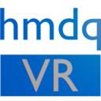

 

# HMDQ Tools
HMDQ Tools is a set of two command line tools for VR headsets and other hardware introspection with support for both OpenVR and Oculus runtimes. The tools are also used to collect the data for and build the [HMD Geometry Database](https://risa2000.github.io/hmdgdb/).

## `hmdq`
is a main tool, which connects to a VR subsystem and collects all available data about the connected devices (_tracked devices_ in OpenVR world, headsets, trackers and controllers in Oculus world).  

It can either display the info in the console, or save all the collected information plus some additional calculated data to a file in JSON format.

One needs to have either OpenVR or Oculus runtime plus the corresponding hardware installed and connected to use the tool.

## `hmdv`
is a complementary tool, whose only purpose is to process the data files created by `hmdq` and display them in a human friendly way.

Both tools use very similar command line interface. The only (major) difference is that `hmdq` reads the data it shows (and stores) from actual VR runtime, while `hmdv` reads the data from already stored file. The following paragraphs address both tools, unless it is explicitly specified otherwise.

## Installation
Get the latest binary ZIP from [releases](https://github.com/risa2000/hmdq/releases) and unzip it wherever you want to run it. The package should contain both `hmdq` and `hmdv` tools, this README file, LICENSE file, OpenVR API JSON file and some additional files to ease the use.

## Operation
Since both tools are command line tools, it is better to run them from Windows console or any terminal (window) which supports standard I/O.

When the tools run the first time, they create a configuration file `<tool_name>.conf.json` in the same directory.

Another file which is necessary (and is present in the archive) is OpenVR API description file (`openvr_api.json`). This file can be updated independently of HMDQ tools.

### Commands

#### `help`
Shows all the commands and options with short descriptions.

* `hmdq`
```
$ hmdq help
Usage:
        hmdq (geom|props|all) [-a <name>] [-o <name>] [-v [<level>]] [-n] [--openvr] [--oculus]
             [--ovr_max_fov]

        hmdq version
        hmdq help
Options:
        geom        show only geometry data
        props       show only device properties
        all         show all data (default choice)
        -a, --api_json <name>
                    OpenVR API JSON definition file
                    ["D:\Work\vsprojects\hmdq\out\build\x64-DLL-Debug\hmdq\openvr_api.json"]

        -o, --out_json <name>
                    JSON output file

        -v, --verb <level>
                    verbosity level [0]

        -n, --anonymize
                    anonymize serial numbers in the output [false]

        --openvr    show only OpenVR data
        --oculus    show only Oculus data
        --ovr_max_fov
                    show also Oculus max FOV data

        version     show version and other info
        help        show this help page
```
* `hmdv`
```
$ hmdv help
Usage:
        hmdv (geom|props|all) [-a <name>] [-o <name>] [-v [<level>]] [-n] [--openvr] [--oculus]
             [--ovr_max_fov] <in_json>

        hmdv verify <in_json>
        hmdv version
        hmdv help
Options:
        geom        show only geometry data
        props       show only device properties
        all         show all data (default choice)
        -a, --api_json <name>
                    OpenVR API JSON definition file
                    ["D:\Work\vsprojects\hmdq\out\build\x64-DLL-Debug\hmdv\openvr_api.json"]

        -o, --out_json <name>
                    JSON output file

        -v, --verb <level>
                    verbosity level [0]

        -n, --anonymize
                    anonymize serial numbers in the output [false]

        --openvr    show only OpenVR data
        --oculus    show only Oculus data
        --ovr_max_fov
                    show also Oculus max FOV data

        <in_json>   input data file
        verify      verify the data file integrity
        <in_json>   input data file
        version     show version and other info
        help        show this help page
```

#### `geom`
Displays the headset geometry which is normally advertised by VR subsystem to the application. It includes:

* View geometry (rendered FOVs) for each eye.
* Total stereo rendered FOVs and the overlap.
* Rotation of the virtual cameras (views).
* IPD value.

Additionally to that, it also shows:

* The recommended render target resolution.
* The size of the _hidden area mask_ (HAM) mesh (if supported by the headset).

Example (excerpt):
```c
Total FOV:
    horizontal: 108.77 deg
    vertical:   111.48 deg
    diagonal:   113.18 deg
    overlap:     93.45 deg

View geometry:
    left view rotation:     0.0 deg
    right view rotation:    0.0 deg
    reported IPD:           63.0 mm
```

#### `props`
Prints out all different _properties_ for all currently detected _devices_. For OpenVR it includes not only the headset and the controllers, but also the lighthouses and the additional (not lighthouse tracked) devices as the gamepads. The number of properties shown depends on the _verbosity_ level specified by the user, which, by default, is set to `0`.

Example (excerpt):
```c
Device enumeration:
    Found dev: id=0, class=1, name=HMD
    Found dev: id=1, class=4, name=TrackingReference
    Found dev: id=2, class=4, name=TrackingReference

[0:HMD]
    1000 : TrackingSystemName = "lighthouse"
    1001 : ModelNumber = "Vive. MV"
    1002 : SerialNumber = "anon@1B02287EBB399418DC264E14"
    1003 : RenderModelName = "generic_hmd"
    1004 : WillDriftInYaw = false
    1005 : ManufacturerName = "HTC"
    1006 : TrackingFirmwareVersion = "1462663157 steamservices@firmware-win32 2016-05-08 FPGA 262(1.6/0/0) BL 0"
    1007 : HardwareRevision = "product 128 rev 2.1.0 lot 2000/0/0 0"
    1008 : AllWirelessDongleDescriptions = "anon@E0274499D83512E548FB4966"
    2001 : SecondsFromVsyncToPhotons = 0.0111111
    2002 : DisplayFrequency = 90
```

#### `version`
Shows the tool version info plus some additional information about the build and the used libraries.

#### `verify` (only in `hmdv`)
Verifies the data file checksum.

#### `all (default)`
Processes both `geom` and `props`. This is the default command.

### Options

#### `--api_json <filename>`
Allows specifying a custom/different/new JSON file with OpenVR API definitions. Normally, you should not need that. The one included comes directly from [OpenVR repository](https://github.com/ValveSoftware/openvr/tree/master/headers).

You can update this file independently from the tools to let them recognize new properties (if there were any).

#### `--out_json <filename>`
When specified, all the information collected by the tool (not only what is actually displayed in the console, but all possible retrievable information), plus some additional information calculated by the tool in the process (e.g. different _FOV points_, HAM mesh optimized layout, etc.) is stored in the specified file in JSON format.

This file is mostly useful for additional processing, evaluation, and future reference.

**NOTE:** _The amount of the information stored in the file, **is not controlled by the verbosity level**. Every time the file is created, all the available information plus the additionally computed data are stored in the file. The reason for that is to have a well defined set of data, which is guaranteed to be present._

When this option is used with `hmdv` it just rewrites the information from the input file to the output file. It is useful to anonymize the input file or to update the data content to the latest version (see the Changelog file for the details).

#### `-v <level>, --verb <level>`
Verbosity level of the output (to the console). There are five levels defined:

* `--verb -1`  
Silent running. Shows only the basic startup info.
* `--verb 0 (default)`  
The default one, shows just the basic information in both `geom` and `props` modes.
* `--verb 1`  
All the information available for `geom` part is displayed, and the basic information for `props`.
* `--verb 2`  
Adds few more properties in `props` mode (specified in the config file).
* `--verb 3`  
Shows all the properties, which are supported by each device currently detected and identified by the system.
* `--verb 4`  
Adds as well all the properties, which are defined by the OpenVR API, but are neither supported by the devices, nor are supported by the tool itself (the reason is explained by the error message given in the console output).

The levels can be redefined in the configuration file. The values listed above are the default ones.

#### `-n, --anonymize`
If specified, it will anonymize values of some "sensitive" properties defined in the configuration file. Others can be added to the config file if needed.

The anonymization happens in both the console output and in the output JSON file.

This could be useful when sharing the output data publicly, without disclosing the unique identifiers.

The anonymized values are computed by using the secure hash function [Blake2](https://blake2.net) set with 96-bit wide output. The hash is computed over three properties: manufacturer name (#1005 `Prop_ManufacturerName_String` in OpenVR), concatenated with model name (#1001 `Prop_ModelNumber_String` in OpenVR), and finally with the incriminated value to anonymize. The manufacturer and model names are used to pre-seed the hash with distinct values, so the same serial numbers from different manufacturers will not anonymize into the same values.

#### `--openvr`
Will only show data collected from OpenVR runtime (if one is present and any hardware is connected).

#### `--oculus`
Will only show date collected from Oculus runtime (if one is present and a headset is connected).

Both options are meant to only control the program output, but the data are logged and saved into the data file (if requested by `--out_json` option) for both subsystems.

#### `--ovr_max_fov`
Shows also data for Oculus headset _Maximum FOV_.

### Configuration
The configuration file `<tool_name>.conf.json` is always created with the default values, and can be changed later by the user. The tool will not "touch" the configuration file as long as it exists and only create a new one if none is present.

It has a consequence when updating the tool to the newer version. It may happen that the new version of the tool introduces new config values, which are not present in the old configuration file, or remove some old ones. When it happens the tool will refuse to run and ask the user to manually update the configuration file.

One way how to do it is letting the tool to create a new (default) config file (e.g. by renaming the old one) and then manually copy any custom setting from the old config to the new one.

Configuration options:

* `meta` section is read-only. Changing it has no meaning or impact on the tool operation.
* `control`
    * `anonymize` decides whether the sensitive data (the serial numbers) are anonymized by default. Default value is `false`.
* `format` defines the indentation (in spaces):
    * `cli_indent` for standard output in the console,
    * `json_indent` for the output JSON file.
* `verbosity` defines all the different verbosity levels to which the user specified verbosity (set by `--verb` on the command line) is compared.
    * `silent` defines the level, which, when specified by user, will display only the basic startup info.
    * `default` is default verbosity level which the tool will use, when none is specified on the command line.
    * `geom` is the level at which all the geometry properties (displayed in `geom` command) are shown.
    * `max` defines the level at which all properties _with meaningful values_ are included in the console output.
    * `error` - the level which, when specified, will also display unsupported properties (with errors).
* `openvr` (only used by OpenVR runtime or when processing OpenVR data)
    * `app_type` defines how the tool initializes the OpenVR subsystem in `vr::VR_Init` call. The different application types are described [here](https://github.com/ValveSoftware/openvr/wiki/API-Documentation#initialization-and-cleanup).  
    **Note**: _Basically anything different from the default value is untested and unsupported. Putting in a wrong type can also impact the reported values. So only change it if you know what you are doing._
    * `verbosity`
        * `properties` defines individual verbosity levels for listed properties. The default list is more of an example than some sophisticated choice. The number defines the minimal required verbosity level specified by the user, in order to have the property value displayed in the output.
    * `anonymize`
        * `properties` defines a list of tracked device properties which are anonymized, if requested either by the user with the command line option or by specifying the default behavior in the config file.
* `oculus` (only used by Oculus runtime or when processing Oculus data)
    * `init_flags` default value for the runtime initialization.
    * `verbosity` (the same as for OpenVR)
    * `anonymize` (the same as for OpenVR)

## Theory behind the FOV calculations
While listing the properties of (tracked) devices is a mundane task, the rendered FOV calculation is an interesting topic which deserves its own space and is in detail dissected here [VR headset rendered FOV calculation](https://risa2000.github.io/vrdocs/docs/hmd_fov_calculation).

## Building the tool from the source code
The tools are being developed as a fun project, so they are probably overdone on many levels, but should never the less be buildable.

### Required external libraries
* [`muellan/clipp`](https://github.com/muellan/clipp)
for parsing the command line arguments.
* [`QuantStack/xtensor`](https://github.com/QuantStack/xtensor) for all 2D, 3D vectors and matrices operations.
* [`QuantStack/xtl`](https://github.com/QuantStack/xtl) required by `QuantStack/xtensor`.
* [`nlohmann/json`](https://github.com/nlohmann/json) for all JSON parsing and creating.
* [`nlohmann/fifo_map`](https://github.com/nlohmann/fifo_map) for ordered map support.
* [`ValveSoftware/openvr`](https://github.com/ValveSoftware/openvr) for obvious reasons.
* [`randombit/botan`](https://github.com/randombit/botan) for secure hash implementation.
* [`fmtlib/fmt`](https://github.com/fmtlib/fmt) for comfortable printing and formatting of the console output.
* [`Oculus SDK`](https://developer.oculus.com/downloads/package/oculus-sdk-for-windows/)
* [`libeigen/eigen`](https://gitlab.com/libeigen/eigen) for FOV calculations.

On top of that you will also need `cmake` version 3.15 or higher.

### Optional external libraries
* [`Catch2`](https://github.com/catchorg/Catch2) to build unit tests.

### Building
The project is developed as a "CMake project" in Visual Studio 2019, while using `ninja` as a build driver. The binary can be successfully built by native MSVC compiler `cl` or by LLVM `clang-cl` (Clang drop in replacement for MSVC compiler).

Building with `clang-cl` may provide some additional challenges which however should not surprise anyone who is using this compiler and as such is already accustomed to some roughing.

To have the automatic versioning working correctly, CMake scripts expect the build to happen in a locally cloned `git` repository.
